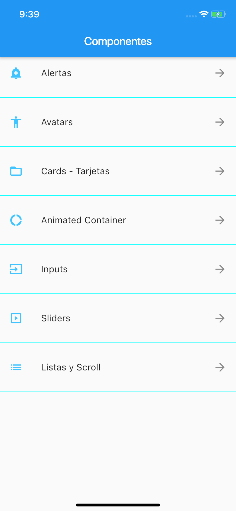
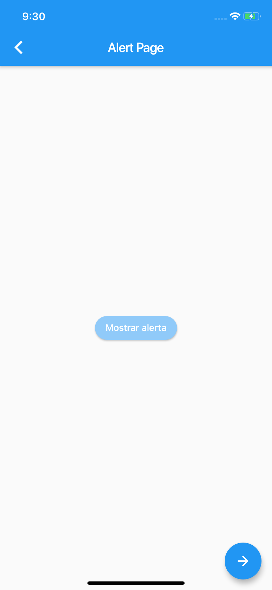
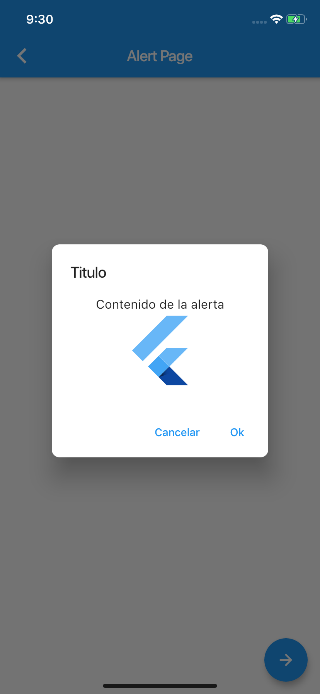

# Flutter_P2
Practica hecha con fines de aprender más sobre los componentes de Flutter.

# Segunda practica del framework flutter con el lenguaje dart.

Aplicacion móvil probada en simulador para IOS, con una compilación de componentes.

# Requerimientos 

Instalar Xcode, Visual Studio Core y Simulator para IOS.
Para Visual Studio instalar siguientes plugins:
* Dart(Version usada en este proyecto 3.5.1).
* Flutter(Version usada en este proyecto 3.5.1).
* Awesome Flutter Snippet(Version usada en este proyecto 2.0.2).
* Bracket Pair Colorizer 2(Version usada en este proyecto 0.0.28).

# Código 

Todo esta en la carpeta "lib", los complementos estan en las otras.

## Autores 

* **Ferrer Garcia Erick** - [ErickFerrer96](https://github.com/ErickFerrer96)

## Documentacion de Flutter usada en este proyecto

[Documentación](https://flutter.dev/docs)

## Galeria

Todas las screenshoots presentadas estan en la carpeta de Imagenes.

| Componente | Descripción | Imagenes |
| --- | --- | --- |
| Ninguno | Menú de la app |  |
| Alerta |  Sirve para ver como funciona una alerta |
| 
